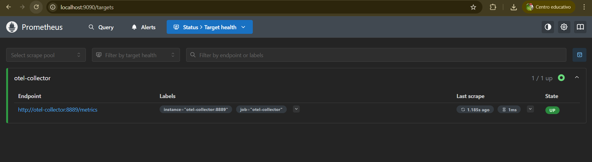

## ¿Qué significa instance="otel-collector:8889"?
En Prometheus, la etiqueta `job` identifica el servicio monitoreado, mientras que `instance` identifica la fuente exacta de la métrica. Por ejemplo:

job="otel-collector" indica que la métrica proviene del OpenTelemetry Collector.
instance="otel-collector:8889" indica que la métrica fue expuesta desde el contenedor otel-collector en el puerto 8889.

